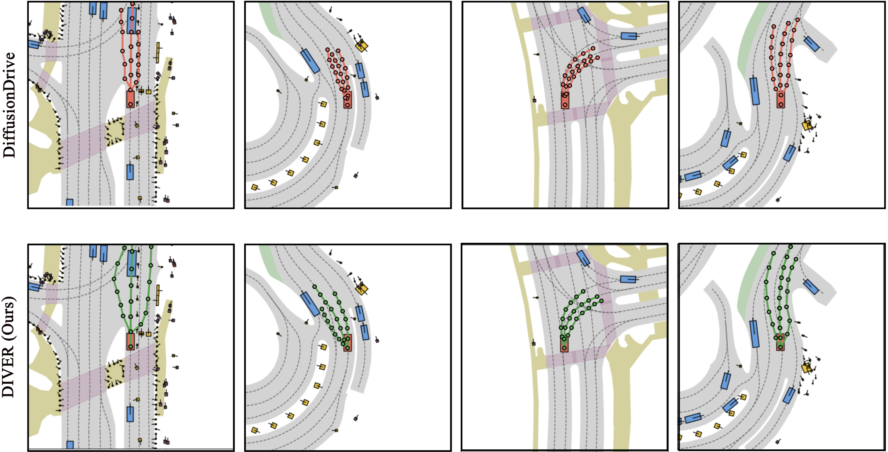
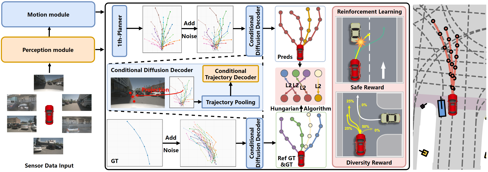

# [DIVER] Breaking Imitation Bottlenecks: Reinforced Diffusion Powers Diverse Trajectory Generation

<div align="justify">  

This is the official repository of [**DIVER**](https://arxiv.org/abs/2503.03125). 


</div>

<div align="center">
  
</div>

## Abstract
<div align="justify">
  Existing end-to-end autonomous driving (E2E-AD) methods predominantly rely on single expert demonstrations through imitation learning, often leading to conservative and homogeneous driving behaviors that struggle to generalize to complex real-world scenarios. In this work, we propose DIVER, a novel E2E-AD framework that combines diffusion-based multi-mode trajectory generation with reinforcement learning to produce diverse, safe, and goal-directed trajectories. First, the model conditions on map elements and surrounding agents to generate multiple reference trajectories from each ground-truth reference trajectory that overcome the inherent limitations of single-mode imitation. Second, we treat the diffusion process as a stochastic policy and employ Group Relative Policy Optimization (GPRO) objectives to guide the diffusion process. By optimizing trajectory-level rewards for both diversity and safety, GRPO directly mitigates mode collapse and enhances collision avoidance, encouraging exploration beyond expert demonstrations and ensuring physically plausible plans. Furthermore, to address the limitations of L2-based open-loop metrics in capturing trajectory diversity, we propose a novel trajectory diversity metric to evaluate the diversity of multi-mode predictions. Extensive experiments on the closed-loop NAVSIM and Bench2Drive benchmarks, as well as the open-loop nuScenes dataset, demonstrate that DIVER significantly improves trajectory diversity, effectively addressing the mode collapse problem inherent in imitation learning.
</div>


<div align="justify">
:fire: Contributions:
* **DIVER Concept.**  We propose the DIVER, an novel multi-mode E2E-AD framework that uses reinforcement learning to guide diffusion models in generating diverse and feasible driving behaviors.

* **Diffusion Model.** We introduce the Policy-Aware Diffusion Generator (PADG), which incorporates map elements and agent interactions as conditional inputs, enabling the generation of multi-mode trajectory that capture diverse driving styles.

* **Reinforcement Learning.** We leverage reinforcement learning to guide the diffusion model with diversity and safety rewards, addressing the limitations of imitation learning.

* **Diversity Metric.** We propose a novel Diversity Metric to evaluate multi-mode trajectory generation, providing a more principled way to assess the diversity and effectiveness of generated trajectories compared to existing metrics.

* **Performance Evaluation.** Extensive evaluations on the Bench2Drive, NAVSIM, NuScenes demonstrate that DIVER significantly improves the diversity, safety, and feasibility of generated trajectories over state-of-the-art methods.
 </div>


## Method
<center>
    
    <br>
    <div style="color:orange; border-bottom: 1px solid #d9d9d9;
    display: inline-block;
    color: #999;
    padding: 2px;">The overall architecture of DIVER. As a multi-mode trajectory E2E-AD framework, DIVER first encodes multi-view images into feature maps to extract scene representations through a perception module. It then predicts the motion of surrounding agents and performs planning via a conditional diffusion model guided by reinforcement learning to generate diverse multi-intention trajectories. Our approach effectively addresses the inherent mode collapse in imitation learning, enabling the generation of safe and diverse behaviors for complex driving scenarios.</div>
</center>


## Results in paper

### Open-loop mertics

- Planning results on [nuScenes](https://github.com/nutonomy/nuscenes-devkit).

| Method |  L2 (m) 1s  | L2 (m) 2s | L2 (m) 3s | L2 (m) Avg | Col. (%) 1s | Col. (%) 2s | Col. (%) 3s | Col. (%) Avg | 
| :---: | :---:| :---: | :---: | :---: | :---: | :---: | :---: | :---: |
| UniAD | 0.07| 0.14| 0.24| 0.15 |0.03| 0.05| 0.16| 0.08 |
SparseDrive |0.05| 0.11| 0.23| 0.13| **0.01**| 0.05| 0.18| 0.08|
**DIVER (Ours)**   | **0.10**| **0.19**| **0.34**| **0.21**| **0.01**| **0.05**| **0.15**| **0.07**|

- Planning results on the Turning-nuScenes validation dataset [Turning-nuScenes ](https://github.com/adept-thu/MomAD/blob/main/open_loop/nuscenes_infos_val_hrad_planing_scene.pkl). 

| Method |L2 (m) 1s  | L2 (m) 2s | L2 (m) 3s  | Col. (%) 1s | Col. (%) 2s | Col. (%) 3s |
| :---: | :---:| :---: | :---: | :---: | :---: | :---: |
|SparseDrive| 0.09| 0.18| 0.36|  0.04| 0.17| 0.98|
|DiffusionDrive| 0.11| 0.21| 0.37| **0.03**| 0.14| 0.85|
|MomAD |0.09| 0.17 |0.34| **0.03** |0.13| 0.79|
|**DIVER (Ours)** |**0.17**| **0.29**| **0.47**| **0.03**| **0.11**| **0.67**|

- Planning results on the Bench2Drive dataset [Bench2Drive](https://github.com/Thinklab-SJTU/Bench2Drive). 


|           Method           | Traj. |  Scheme |     Venue    | Avg. L2 ↓ | Div.<sup>(t)</sup> ↑ |    DS ↑   |  SR (%) ↑ |   Effi ↑   |   Comf ↑  |   Merg.   |  Overta.  |  Emerge.  |  Give Way | Traffic Sign |    Mean   |
| :------------------------: | :---: | :-----: | :----------: | :-------: | :------------------: | :-------: | :-------: | :--------: | :-------: | :-------: | :-------: | :-------: | :-------: | :----------: | :-------: |
|             VAD            |   ST  |    IL   |   ICCV 2023  |    0.91   |           -          |   42.35   |   15.00   |   157.94   |   46.01   |    8.11   |   24.44   |   18.64   |   20.00   |     19.15    |   18.07   |
|            GenAD           |   ST  |    IL   |   ECCV 2024  |     -     |           -          |   44.81   |   15.90   |      -     |     -     |     -     |     -     |     -     |     -     |       -      |     -     |
|         MomAD(VAD)         |   MT  |    IL   |   CVPR 2025  |    0.87   |         0.18         |   45.35   |   17.44   |   162.09   |   49.34   |    9.99   |   26.31   |   20.07   |   20.00   |     20.23    |   19.32   |
|          MomAD(SD)         |   MT  |    IL   |   CVPR 2025  |    0.82   |         0.20         |   47.91   |   18.11   |   174.91   |   51.20   |   13.21   |   21.02   |   18.01   |   20.00   |     21.07    |   18.66   |
|     VAD<sub>mmt</sub>†     |   MT  |    IL   |   ICCV 2023  |    0.89   |         0.20         |   42.87   |   15.91   |   158.12   |   47.22   |    9.43   |   25.31   |   19.91   |   20.00   |     20.09    |   18.95   |
|      **DIVER (Ours)**      |   MT  | IL & RL |       –      |  **1.13** |       **0.32**       | **47.95** | **19.47** | **164.66** | **51.28** | **13.83** | **29.09** | **25.51** | **20.00** |   **24.93**  | **22.67** |
|        SparseDrive†        |   MT  |    IL   |   ICRA 2025  |    0.87   |         0.21         |   44.54   |   16.71   |   170.21   |   48.63   |   12.18   |   23.19   |   17.91   |   20.00   |     20.98    |   17.45   |
|      **DIVER (Ours)**      |   MT  | IL & RL |       –      |  **1.05** |       **0.35**       | **49.21** | **21.56** | **177.00** | **54.72** | **15.98** | **28.22** | **23.71** | **20.00** |   **24.38**  | **22.46** |


## Quick Start
[Quick Start for Open_loop](docs/nus_quick_start.md)

[Quick start for Close_loop](close_loop/b2d_quick_start.md)

## Citation
If you find DIVER is useful in your research or applications, please consider giving us a star 🌟 and citing it by the following BibTeX entry.

```
@article{song2025breaking,
  title={Breaking imitation bottlenecks: Reinforced diffusion powers diverse trajectory generation},
  author={Song, Ziying and Liu, Lin and Pan, Hongyu and Liao, Bencheng and Guo, Mingzhe and Yang, Lei and Zhang, Yongchang and Xu, Shaoqing and Jia, Caiyan and Luo, Yadan},
  journal={arXiv preprint arXiv:2507.04049},
  year={2025}
}
```

## Acknowledgement
- [SparseDrive](https://github.com/swc-17/SparseDrive)
- [UniAD](https://github.com/OpenDriveLab/UniAD) 
- [VAD](https://github.com/hustvl/VAD)
- [mmdet3d](https://github.com/open-mmlab/mmdetection3d)
- [MomAD](https://github.com/adept-thu/MomAD)
- [DiffusionDrive](https://github.com/hustvl/DiffusionDrive)


